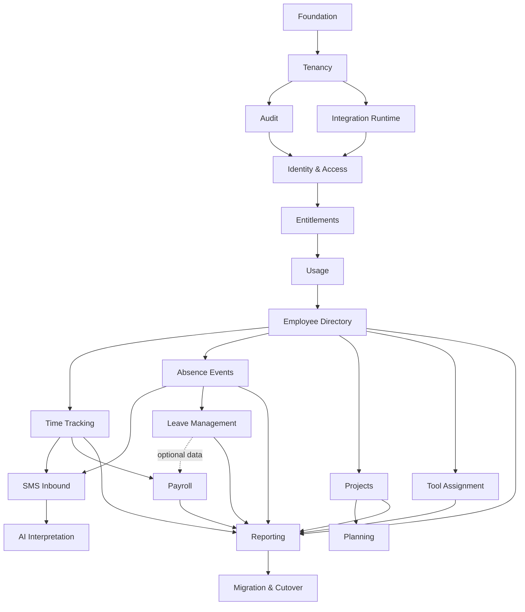

# SMS Modular — indeks planów implementacyjnych

Ten katalog przekłada [architekturę docelową](../sms-modular-architecture-outline.md)
na plany gotowe do implementacji. Każdy moduł ma jednego właściciela danych,
publiczne kontrakty i niezależne kryteria ukończenia. Sąsiednie repozytorium
`../sms2` jest źródłem reguł i danych migracyjnych, ale nie wzorcem architektury
multi-tenant.

Wspólny kierunek interfejsu i zasada maksymalnie dwóch kliknięć są pokazane w
[propozycjach UI](../ui-proposals/README.md).

## Jak korzystać z dokumentów

1. Przed modułami wykonać [fundament](foundation.md).
2. Realizować moduły według fal poniżej; elementy w jednej fali można prowadzić
   równolegle dopiero po spełnieniu bramki poprzedniej fali.
3. Encje i repozytoria są prywatne. Zależność oznacza użycie kontraktu modułu,
   nigdy dostęp do jego tabel.
4. Każdy etap kończy się testami backendu, Angulara, izolacji tenanta i kontraktu.
5. Migrację danych wykonywać przez adaptery właścicielskich modułów.

## Roadmapa

| Fala | Moduły | Bramka wyjściowa |
| --- | --- | --- |
| 0 | [Fundament](foundation.md) | PostgreSQL, Liquibase, Problem Details, Testcontainers i test granic modułów |
| 1A | [Tenancy](platform/tenancy.md) | `TenantContext` oraz RLS potwierdzone testem dwóch tenantów |
| 1B | [Audit](platform/audit.md), [Integration Runtime](platform/integration-runtime.md) | audyt i outbox przenoszą tenant oraz correlation ID |
| 1C | [Identity & Access](platform/identity-access.md) | JWT, permissions i kontekst sesji działają tenant-scoped |
| 1D | [Entitlements](platform/entitlements.md), potem [Usage](platform/usage.md) | backend rozróżnia permission, entitlement i limit |
| 2A | [Employee Directory](base/employee-directory.md) | stabilny kontrakt projekcji pracownika |
| 2B | [Time Tracking](base/time-tracking.md), [Absence Events](base/absence-events.md) | gotowe komendy domenowe dla SMS |
| 3 | [SMS Inbound](base/sms-inbound.md), potem [AI Interpretation](base/ai-interpretation.md) | pełny inbound → parser/AI → czas/nieobecność/review |
| 4A | [Leave Management](addons/leave-management.md), [Projects](addons/projects.md), [Tool Assignment](addons/tool-assignment.md) | dodatki chronione entitlementami |
| 4B | [Planning](addons/planning.md), [Payroll](addons/payroll.md) | zależności dodatków i snapshoty bez dostępu do obcych tabel |
| 5 | [Reporting](reporting/read-models.md) | dashboard i raporty korzystają z read modeli |
| 6 | [Migracja i cutover](migration/sms2-cutover.md) | próbna migracja uzgodniona licznościowo i finansowo |

## Graf zależności

## Kontrakty przekrojowe

| Kontrakt | Właściciel | Konsumenci |
| --- | --- | --- |
| `TenantId`, `TenantContext` | Tenancy | wszystkie moduły tenant-scoped |
| `ActorRef`, `AuditPort` | Audit | wszystkie komendy zmieniające stan |
| `OutboxEvent`, `JobContext` | Integration Runtime | SMS, AI, raportowanie i integracje |
| `CapabilityKey`, `EntitlementSnapshot` | Entitlements | backend, shell Angular i dodatki |
| `UsageMetric`, `UsageMeter` | Usage | SMS, AI, użytkownicy, pracownicy, projekty |
| `EmployeeSummary`, `EmployeeDirectoryPort` | Employee Directory | czas, nieobecności, dodatki |
| `RegisterWorkEntryCommand` | Time Tracking | SMS Inbound |
| `RegisterAbsenceEventCommand` | Absence Events | SMS Inbound i Leave Management |
| `InterpretSmsPort` | AI Interpretation | SMS Inbound |
| `SmsDispatchPort` | Integration Runtime | Projects |

## Globalna definicja ukończenia

- migracja Liquibase posiada rollback albo udokumentowaną procedurę odtworzenia;
- wszystkie tabele klienta mają `tenant_id`, RLS i tenant-scoped indeksy;
- API jest w `/api/v1`, a administracja platformy w `/api/platform/v1`;
- test udowadnia brak odczytu i zapisu między tenantami;
- permission i entitlement są sprawdzane po stronie backendu;
- zdarzenia i joby posiadają tenant, correlation ID, wersję i idempotency key;
- frontend obsługuje loading, empty, validation, forbidden i retryable error;
- OpenAPI, metryki, logi bez danych wrażliwych oraz runbook operacyjny są aktualne;
- plan migracji SMS2 dla modułu jest wykonany lub oznaczony jako greenfield.
