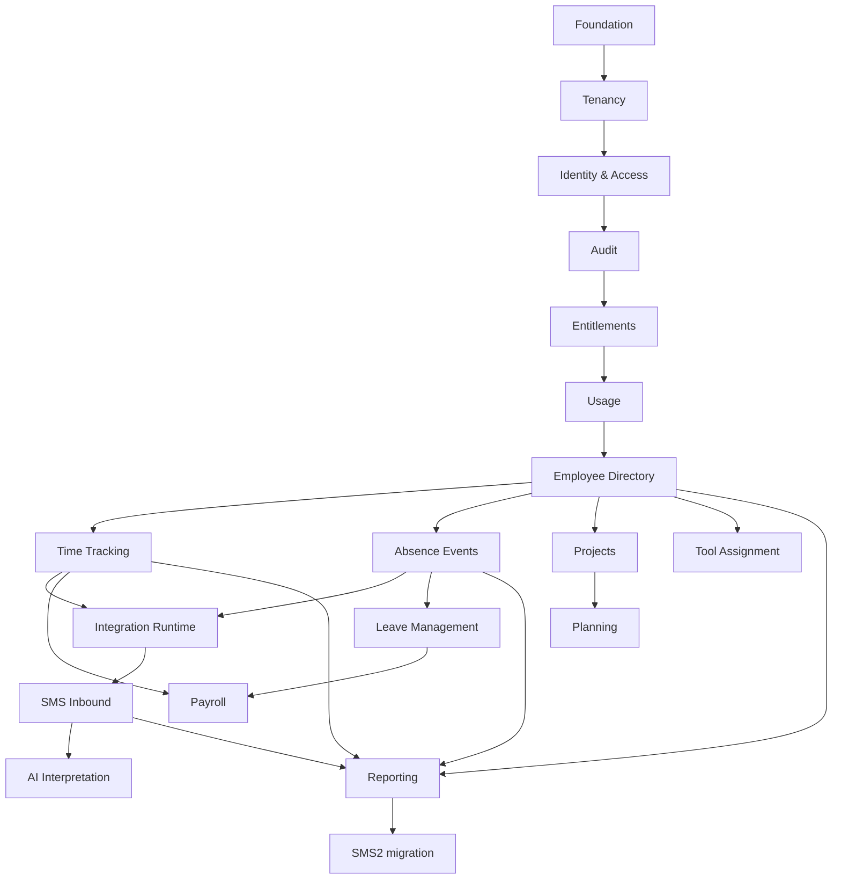

# SMS Modular — kolejność implementacji

Dokumenty opisują zachowania legacy, wymagania produktu i makiety. Implementacja
powstaje etapami jako prosty modularny monolit warstwowy.

Etapy 0–5 są wdrożone. Etap 5 obejmuje Entitlements oraz pomiar aktywnych
użytkowników w Usage. Pozostałe metryki Usage powstaną wraz z modułami, które
je wytwarzają. Następny etap to Employee Directory.

## Zasady realizacji

1. Moduł dostarcza działającą pionową funkcję: baza, API, serwis i UI, gdy UI ma
   zastosowanie.
2. W obrębie modułu stosujemy `controller`, `service`, `repository`, `entity`,
   `dto`; encja JPA jest jedynym modelem zapisu.
3. Reguły i przejścia biznesowe są w serwisach.
4. Moduły nie używają cudzych encji ani repozytoriów. Do komunikacji służą
   identyfikatory i małe DTO/publiczne metody tylko wtedy, gdy istnieje konsument.
5. Nie dodajemy pustych modułów, changelogów ani providerów przed ich użyciem.
6. Każda tabela tenantowa jest izolowana przez jawne `tenantId` w kontrolerach,
   serwisach i zapytaniach oraz przez tenantowe klucze i ograniczenia bazy.

## Roadmapa

| Etap | Moduły | Bramka ukończenia |
| --- | --- | --- |
| 0 | Reset i szkielet | minimalny backend, frontend, Compose i master changelog |
| 1 | Foundation | Problem Details, correlation ID, walidacja, PostgreSQL/Liquibase i podstawowe reguły ArchUnit |
| 2 | [Tenancy](platform/tenancy.md) | jedna encja tenant, tenant service i tenantowe repozytorium |
| 3 | [Identity & Access](platform/identity-access.md) | logowanie, JWT, permissions i bezpieczne endpointy tenant/platform |
| 4 | [Audit](platform/audit.md) | zapis audytu dla operacji zmieniających stan i filtrowany odczyt |
| 5 | [Entitlements](platform/entitlements.md), potem [Usage](platform/usage.md) | wdrożone: plan BASE v1, katalog modułów, dodatki, limit aktywnych użytkowników i jego egzekwowanie |
| 6 | [Employee Directory](base/employee-directory.md) | kartoteka i tenantowe wyszukiwanie pracowników |
| 7 | [Time Tracking](base/time-tracking.md), [Absence Events](base/absence-events.md) | rejestracja czasu i nieobecności |
| 8 | [Integration Runtime](platform/integration-runtime.md), [SMS Inbound](base/sms-inbound.md) | trwały inbound, idempotencja, kolejka review i integracja transportowa |
| 9 | [AI Interpretation](base/ai-interpretation.md) | niejednoznaczne wiadomości trafiają do interpretacji lub review |
| 10 | [Leave Management](addons/leave-management.md), [Projects](addons/projects.md), [Tool Assignment](addons/tool-assignment.md) | dodatki z permission i capability |
| 11 | [Planning](addons/planning.md), [Payroll](addons/payroll.md) | planowanie zależne od Projects i rozliczenia oparte na snapshotach |
| 12 | [Reporting](reporting/read-models.md) | dashboard/raporty przez serwisy odczytu, read model dopiero przy potrzebie wydajnościowej |
| 13 | [Migracja i cutover](migration/sms2-cutover.md) | próbny import uzgodniony i gotowa procedura przełączenia |

Tenancy najpierw dostarcza tabelę i serwis. Publiczne endpointy tenantów są
udostępniane dopiero po wdrożeniu Identity, aby nie wystawić niezabezpieczonego
API administracyjnego.

## Zależności

## Bramka jakościowa modułu

- Testy serwisu potwierdzają reguły biznesowe i przypadki brzegowe.
- Testy PostgreSQL sprawdzają migracje, relacje i izolację dwóch tenantów.
- Testy API sprawdzają walidację i kodowane błędy.
- Frontend obsługuje loading, empty, error, forbidden i potwierdzenie zapisu.
- Test ArchUnit blokuje dostęp modułu do obcych encji i repozytoriów.
- `tenantId` zawsze pochodzi z principalu albo rekordu zaufanego zadania.

Migracja SMS2 następuje dopiero po modułach, które są właścicielami
importowanych danych. Każdy import jest powtarzalny i generuje raport kolizji.
