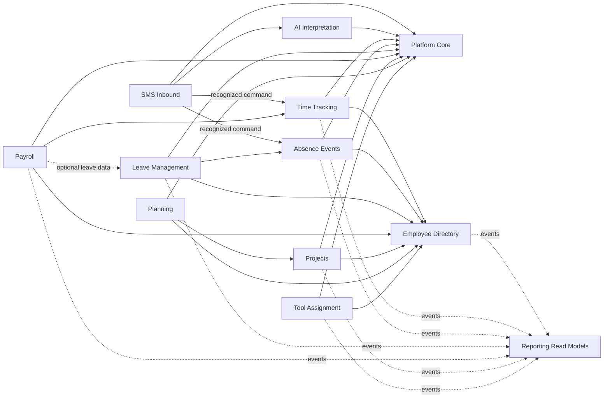

# SMS Modular — podział funkcji i zarys architektury multi-tenant

> Szczegółowe plany wykonawcze modułów, ich zależności i kolejność realizacji:
> [indeks planów implementacyjnych](implementation/README.md).

> Dokument docelowy dla pierwszej wersji architektury modularnego SaaS.
> Źródłem funkcji istniejącego systemu jest
> [`sms2-current-project-inventory.md`](sms2-current-project-inventory.md).

## 1. Cel i podjęte decyzje

SMS Modular będzie modularnym monolitem, w którym klient zawsze otrzymuje pakiet
bazowy, a pozostałe funkcje są aktywowane jako niezależne dodatki. Granice
modułów mają umożliwić późniejsze wydzielenie usługi bez kopiowania tabel i
logiki domenowej między obszarami.

Decyzje przyjęte dla pierwszej wersji:

- tenant oznacza jedną firmę;
- konto użytkownika może należeć tylko do jednego tenanta;
- dane tenantów znajdują się we wspólnej bazie i wspólnym schemacie PostgreSQL;
- izolacja opiera się na obowiązkowym `tenant_id`, kontroli aplikacyjnej i
  PostgreSQL Row-Level Security;
- produkt ma plan bazowy oraz opcjonalne dodatki;
- konfiguracją planu i dodatków zarządza administrator platformy;
- model jest przygotowany na okresy obowiązywania, limity i przyszły billing,
  ale pierwsza wersja nie integruje operatora płatności;
- SMS przychodzące i ich interpretacja przez AI należą do pakietu bazowego;
- pakiet bazowy nie wysyła automatycznych odpowiedzi ani kampanii SMS;
- platforma korzysta ze wspólnej bramki SMS, a tenant ma własny routing, limity
  i statystyki użycia.

## 2. Zasady architektoniczne

1. Każda dana biznesowa ma jednego właściciela modułowego.
2. Moduł nie czyta bezpośrednio tabel innego modułu.
3. Komunikacja synchroniczna odbywa się przez małe, jawne kontrakty, a zmiany
   propagowane do read modeli przez zdarzenia i outbox.
4. `TenantContext` jest ustalany przed logiką domenową i jest obowiązkowy w HTTP,
   zadaniach asynchronicznych, zdarzeniach, audycie i integracjach.
5. Entitlement określa, czy tenant kupił funkcję. Permission określa, czy
   konkretny użytkownik może jej użyć. Obie kontrole są obowiązkowe i niezależne.
6. Ukrycie elementu we frontendzie nie jest zabezpieczeniem. Backend sprawdza
   tenant, permission, entitlement i limit przy każdym chronionym przypadku
   użycia.
7. Pakiet bazowy jest kontraktem produktu, a nie jednym dużym modułem kodu.
   Jego funkcje pozostają technicznie rozdzielone.
8. `common` zawiera wyłącznie stabilne typy techniczne, na przykład identyfikator
   korelacji, zegar i bazowe klasy błędów. Nie może stać się zbiorem współdzielonej
   logiki biznesowej.

Porty są wymagane na granicach modułów i przy rzeczywistych providerach
zewnętrznych. Wewnętrzne repozytorium lub fasada JDBC używana przez jeden moduł
może pozostać konkretną klasą infrastrukturalną; nie tworzymy portu i jedynego
adaptera tylko po to, aby przekazać wywołanie dalej.

## 3. Katalog modułów technicznych

### 3.1 Platform Core

Platform Core nie jest sprzedawany osobno i działa dla każdego tenanta.

| Moduł | Odpowiedzialność |
| --- | --- |
| `tenancy` | firma, status, strefa czasowa, locale i cykl życia tenanta |
| `identity-access` | konta, logowanie, reset hasła, role, permissions i sesja |
| `entitlements` | katalog modułów, plany, dodatki, efektywne capabilities i limity |
| `usage` | idempotentne naliczanie użycia SMS, AI i innych limitowanych zasobów |
| `audit` | aktor, tenant, operacja, wynik, czas i correlation ID |
| `integration-runtime` | outbox, retry, leasing zadań i techniczne wykonanie integracji |

Administrator platformy jest osobnym principalem. Nie jest użytkownikiem żadnej
firmy i korzysta z osobnych endpointów oraz jawnych uprawnień platformowych.

### 3.2 Moduły pakietu bazowego

| Moduł | Zakres | Poza zakresem |
| --- | --- | --- |
| `employee-directory` | kartoteka pracowników, status, dane kontaktowe i podstawowe ustawienia czasu | pule urlopowe, stawki payroll, przydziały projektowe |
| `sms-inbound` | webhook, weryfikacja podpisu, routing tenanta, idempotencja, zapis wiadomości, kolejka i review | odpowiedzi automatyczne, kampanie i ręczna wysyłka |
| `ai-interpretation` | provider abstraction, interpretacja niejednoznacznego SMS, confidence, koszt i użycie | logika czasu pracy, nieobecności i innych domen |
| `time-tracking` | dni pracy, przedziały, korekty, konflikty i wyliczenie godzin | naliczanie wynagrodzenia i plan projektu |
| `absence-events` | zapis okresu nieobecności, źródła, podstawowej kategorii i statusu przetwarzania | pule dni, wnioski urlopowe i wieloetapowa akceptacja |

Nieobecność bazowa jest faktem operacyjnym, który może powstać z SMS-a albo
ręcznie. Nie reprezentuje uprawnienia urlopowego. Zaakceptowany wniosek z dodatku
Urlopy tworzy lub aktualizuje odpowiednie zdarzenie w `absence-events` przez
publiczny kontrakt tego modułu.

### 3.3 Dodatki

| Dodatek / capability | Zakres | Zależności |
| --- | --- | --- |
| `LEAVE_MANAGEMENT` | pule dni, typy urlopów, wnioski, akceptacja, kalendarz i historia salda | `employee-directory`, `absence-events` |
| `PAYROLL` | ustawienia i stawki, wyliczenia, snapshoty, raporty, zamknięcia okresów i eksporty | `employee-directory`, `time-tracking`; opcjonalnie dane z `LEAVE_MANAGEMENT` |
| `PROJECTS` | projekty, statusy, archiwizacja, przypisania pracowników, raport projektu i projektowe wysyłki SMS | `employee-directory`; techniczny port wysyłki SMS |
| `PLANNING` | plan dnia, kalendarz, wersje robocze i publikacja planu | aktywne `PROJECTS`, `employee-directory` |
| `TOOL_ASSIGNMENT` | katalog narzędzi, status, wydanie, zwrot, bieżący posiadacz i historia | `employee-directory` |

`TOOL_ASSIGNMENT` w pierwszej wersji nie obejmuje serwisów, szkód, kosztów,
rezerwacji ani przypisania do projektu. Można je później dodać bez zmiany
podstawowego modelu wydania i zwrotu.

Projektowa wysyłka SMS nie rozszerza pakietu bazowego o ogólną komunikację
wychodzącą. Przypadek użycia i odbiorcy należą do `PROJECTS`, natomiast adapter
dostawcy, retry i status dostarczenia są techniczną usługą platformy. Użycie
wiadomości wychodzących jest mierzone oddzielnie.

### 3.4 Raportowanie i eksporty

Eksport specyficzny dla domeny pozostaje w module będącym właścicielem danych.
Przykładowo eksport payroll należy do `PAYROLL`, a lista wydań narzędzi do
`TOOL_ASSIGNMENT`.

Dashboard, podsumowanie zespołu i przyszłe raporty przekrojowe korzystają z
dedykowanych read modeli aktualizowanych zdarzeniami. Moduł raportowy nie może
łączyć tabel właścicieli w ramach transakcji domenowej. Opóźnienie read modelu
jest jawne i monitorowane.

## 4. Mapowanie funkcji SMS2

| Obecny obszar SMS2 | Docelowy właściciel | Sposób podziału |
| --- | --- | --- |
| `auth`, `security`, `user` | `identity-access`, `tenancy` | rola i użytkownik stają się tenant-scoped; platform admin jest oddzielony |
| `employee` | `employee-directory` | podstawowa kartoteka pozostaje w bazie; stawki przechodzą do `PAYROLL`, a urlopy do `LEAVE_MANAGEMENT` |
| `attendance` | `time-tracking` | moduł bazowy, niezależny od payroll i projektów |
| `absence` | `absence-events`, `LEAVE_MANAGEMENT` | fakt nieobecności pozostaje w bazie, a pule i workflow urlopowe trafiają do dodatku |
| `sms` | `sms-inbound`, `ai-interpretation`, kontrakty domen | kanał nie zapisuje samodzielnie czasu ani nieobecności; przekazuje rozpoznaną komendę do właściciela |
| `project` | `PROJECTS`, `PLANNING`, usługa wysyłki | projekty, planowanie i transport SMS mają osobnych właścicieli |
| `payroll` | `PAYROLL` | cały obszar jest opcjonalnym dodatkiem |
| `dashboard`, `teamsummary` | przekrojowe read modele | brak bezpośredniego dostępu do tabel innych modułów |
| `audit` | `audit` w Platform Core | każdy wpis ma tenant, aktora i correlation ID |
| `common` | minimalny shared kernel | logika eksportów i reguły biznesowe wracają do modułów właścicielskich |

## 5. Zależności i kontrakty między modułami



Strzałka oznacza użycie publicznego kontraktu, a nie dostęp do encji lub tabeli.
Kontrakty powinny operować na identyfikatorach, nie na encjach JPA. Minimalny
zestaw kontraktów obejmuje:

- odczyt podstawowej projekcji pracownika;
- rejestrację rozpoznanego przedziału czasu;
- rejestrację zdarzenia nieobecności;
- utworzenie zdarzenia nieobecności z zaakceptowanego urlopu;
- dostarczenie snapshotu danych wejściowych do payroll;
- publikację zdarzeń do read modeli;
- wysłanie wiadomości projektowej przez port komunikacyjny.

Awaria odbiorcy zdarzenia nie cofa transakcji właściciela. Zdarzenie trafia do
outboxa razem z `tenant_id`, wersją kontraktu i correlation ID, a konsument musi
być idempotentny.

## 6. Model tenantów i użytkowników

### 6.1 Tenant

Minimalny tenant zawiera:

- `id` — UUID, techniczny identyfikator;
- `slug` — globalnie unikalny identyfikator administracyjny;
- `name` — nazwa firmy;
- `status` — `ACTIVE`, `SUSPENDED` albo `CLOSED`;
- `timezone` i `locale`;
- znaczniki utworzenia, modyfikacji i zamknięcia.

Zmiana statusu na `SUSPENDED` blokuje operacje biznesowe, ale nie usuwa danych.
`CLOSED` uruchamia osobny, audytowalny proces eksportu i retencji; nie oznacza
natychmiastowego fizycznego usunięcia rekordów.

### 6.2 Użytkownik i dostęp

`User` ma obowiązkowy `tenant_id`. Email jest globalnie unikalny, dzięki czemu
logowanie nie wymaga podania firmy. Ten sam login nie może należeć do dwóch
tenantów. Jeśli w przyszłości pojawi się taki wymóg, zostanie dodana globalna
tożsamość i tabela członkostw; pierwsza wersja nie implementuje tego modelu.

Role są tenant-scoped i mapują się na granularne permissions. Domyślne role mogą
odpowiadać obecnym `ADMIN`, `MANAGER` i `ACCOUNTANT`, ale kod domenowy sprawdza
permission, a nie nazwę roli. Przykładowe permissions to `EMPLOYEE_READ`,
`TIME_EDIT`, `LEAVE_APPROVE`, `PAYROLL_CLOSE` i `PROJECT_PLAN_PUBLISH`.

Token użytkownika zawiera co najmniej:

- `sub` / `userId`;
- `tenantId`;
- identyfikator lub wersję sesji;
- czas wystawienia i wygaśnięcia.

Efektywnych dodatków i limitów nie zapisuje się jako długowiecznych claimów JWT,
ponieważ zmiana pakietu musi zacząć obowiązywać bez oczekiwania na wygaśnięcie
tokenu. Są rozwiązywane po stronie serwera i mogą być krótko cache'owane z
unieważnieniem po zmianie subskrypcji.

## 7. Izolacja danych

### 7.1 Reguły modelu relacyjnego

- Każda tabela zawierająca dane klienta ma `tenant_id NOT NULL` i klucz obcy do
  `tenants`.
- Unikalność biznesowa jest tenant-scoped, na przykład
  `(tenant_id, normalized_phone)`, `(tenant_id, project_code)` i
  `(tenant_id, provider, external_message_id)`.
- Relacje między danymi biznesowymi zawierają `tenant_id` w złożonym kluczu
  obcym. Baza nie pozwala przypisać pracownika jednego tenanta do projektu lub
  narzędzia innego tenanta.
- Identyfikator UUID rekordu nie jest traktowany jako zabezpieczenie i nie
  zastępuje predykatu po `tenant_id`.
- Globalne tabele katalogowe, takie jak katalog capability i definicje planów,
  nie posiadają `tenant_id`.

### 7.2 TenantContext

Dla uwierzytelnionego żądania tenant jest pobierany wyłącznie ze zweryfikowanego
JWT. `tenantId` z nagłówka, ścieżki, query param lub body nie może zmienić
kontekstu. Jeżeli endpoint administracyjny zawiera ID tenanta w ścieżce, może go
obsłużyć tylko principal platformowy.

Każda transakcja biznesowa ustawia lokalną zmienną sesji PostgreSQL, na przykład
`SET LOCAL app.tenant_id`, a polityki RLS porównują ją z kolumną `tenant_id`.
Ze względu na pooling połączeń wolno używać wyłącznie ustawienia lokalnego dla
transakcji; kontekst nie może pozostać na połączeniu po jego zwróceniu do puli.

Migracje i operacje platformowe używają osobnej roli bazodanowej. Obejście RLS
nie jest dostępne dla zwykłego użytkownika aplikacyjnego. Testy izolacji muszą
działać na PostgreSQL, ponieważ H2 nie potwierdzi zachowania polityk RLS.

### 7.3 Procesy poza HTTP

Outbox, job, retry i event przechowują `tenant_id` w rekordzie zadania. Worker
odtwarza `TenantContext` przed wywołaniem logiki i czyści go w bloku `finally`.
Rekord bez tenanta nie może zostać wykonany przez worker domenowy i trafia do
obsługi błędów technicznych.

Logi strukturalne zawierają `tenantId`, `correlationId`, nazwę modułu i typ
operacji, ale nie treść SMS-a, prompt ani dane osobowe.

## 8. Model planów, dodatków i limitów

### 8.1 Stabilne capability keys

```text
EMPLOYEE_DIRECTORY
SMS_INBOUND
AI_INTERPRETATION
TIME_TRACKING
ABSENCE_EVENTS
LEAVE_MANAGEMENT
PAYROLL
PROJECTS
PLANNING
TOOL_ASSIGNMENT
```

Pierwszych pięć capabilities jest obowiązkową podstawą. Nie można ich wyłączyć
pojedynczemu tenantowi przy aktywnej subskrypcji bazowej. Pozostałe są dodatkami.

### 8.2 Tabele konfiguracyjne

| Tabela koncepcyjna | Przeznaczenie |
| --- | --- |
| `module_catalog` | stabilny klucz capability, nazwa, typ `BASE`/`ADD_ON` i status katalogowy |
| `plans` | wersjonowana definicja planu bazowego |
| `plan_modules` | capabilities i domyślne limity przypisane do wersji planu |
| `tenant_subscriptions` | plan tenanta, status i okres obowiązywania |
| `tenant_addons` | dodatek, źródło aktywacji i przedział obowiązywania |
| `tenant_limit_overrides` | czasowe lub kontraktowe nadpisanie konkretnego limitu |
| `usage_counters` | zużycie zasobu dla tenanta i okresu rozliczeniowego |
| `tenant_sms_routes` | mapowanie zweryfikowanego routingu dostawcy na tenant |

Definicja planu jest wersjonowana. Zmiana domyślnych limitów nie modyfikuje
historycznie warunków istniejącej subskrypcji bez jawnej migracji jej wersji.

### 8.3 Rozwiązywanie entitlement

Dla każdego przypadku użycia serwer wylicza `EntitlementSnapshot`:

1. nieaktywny tenant lub subskrypcja oznacza odmowę;
2. capabilities bazowe wynikają z aktywnego planu;
3. dodatek obowiązuje, gdy ma status aktywny i aktualna chwila mieści się w jego
   przedziale obowiązywania;
4. czasowe nadpisanie administratora może zmienić dodatek lub limit, ale nie może
   wyłączyć obowiązkowej podstawy;
5. zależności są walidowane przy zmianie konfiguracji oraz ponownie przy użyciu;
6. wynik zawiera capabilities, limity, zużycie i moment wygaśnięcia snapshotu.

Aktywacja `PLANNING` bez `PROJECTS` jest odrzucana. Wyłączenie `PROJECTS` przy
aktywnym `PLANNING` również jest odrzucane; system nie wykonuje cichej kaskady.

Dezaktywacja dodatku blokuje nowe operacje i usuwa jego nawigację, ale zachowuje
dane. Administrator może je wyeksportować lub ponownie aktywować dodatek.
Odczyty wymagane prawnie lub do rozliczenia odbywają się przez jawne uprawnienie
administracyjne, a nie przez obchodzenie entitlement.

### 8.4 Limity i usage

Pierwsza wersja modeluje co najmniej:

- liczbę aktywnych użytkowników;
- liczbę aktywnych pracowników;
- odebrane SMS-y w okresie;
- wywołania lub budżet AI w okresie;
- SMS-y wychodzące z dodatku Projekty.

Wartości limitów zostaną ustalone w katalogu handlowym, nie w kodzie modułów.
Naliczanie jest idempotentne i korzysta z identyfikatora operacji źródłowej.

Poprawnie podpisany SMS przychodzący jest najpierw trwale zapisywany, nawet gdy
tenant przekroczył limit, aby webhook dostawcy nie powodował utraty lub pętli
ponowień. Dalsza polityka może oznaczyć przekroczenie do obsługi administratora.
Po wyczerpaniu budżetu AI system nadal uruchamia parsery regułowe, a wynik
niejednoznaczny kieruje do review zamiast odrzucać wiadomość.

## 9. Konfiguracja platformy i tenanta

Konfiguracja wdrożeniowa zawiera tylko ustawienia techniczne wspólne dla
instancji. Przykładowy zarys, bez docelowych wartości handlowych:

```yaml
app:
  multitenancy:
    mode: shared-schema
    rls-enabled: true
  entitlements:
    cache-enabled: true
  sms:
    provider: platform-managed
    inbound-enabled: true
    outbound-enabled: true # używane wyłącznie przez uprawnione dodatki
  ai:
    provider: platform-managed
    fallback-to-review: true
```

Sekrety dostawcy SMS i AI są dostarczane z secret managera lub zmiennych
środowiskowych i nie są przechowywane w `application.yaml` ani w ustawieniach
tenanta. Ustawienia specyficzne dla domeny mają typowane tabele właścicielskiego
modułu; jedna niekontrolowana kolumna JSON nie zastępuje modelu konfiguracji.

Tenant może posiadać między innymi strefę czasową, locale, reguły zaokrąglania
czasu oraz ustawienia modułów, które ma aktywne. Brak wymaganej konfiguracji
powoduje czytelny błąd aktywacji modułu, a nie częściowe uruchomienie workera.

## 10. Przepływ SMS przychodzącego

1. Dostawca wywołuje publiczny webhook.
2. Warstwa integracyjna weryfikuje podpis, timestamp i ochronę przed replay.
3. Tenant jest ustalany z konfiguracji dostawcy i mapowania routingu, nigdy z
   dowolnego `tenantId` w payloadzie.
4. System zapisuje wiadomość z kluczem idempotencji
   `(tenant_id, provider, external_message_id)` oraz zadanie outbox.
5. Worker odtwarza tenant context i uruchamia parsery regułowe.
6. Jeżeli wynik jest niejednoznaczny i limit pozwala, `ai-interpretation`
   zwraca ustrukturyzowaną intencję wraz z confidence.
7. Router intencji wywołuje publiczną komendę `time-tracking` albo
   `absence-events`. Moduł SMS nie zapisuje ich tabel bezpośrednio.
8. Niski confidence, brak limitu AI, nieznany pracownik albo konflikt trafia do
   tenant-scoped review.
9. Webhook nie generuje automatycznej odpowiedzi do pracownika.

Numer telefonu pracownika jest unikalny tylko w obrębie tenanta. Najpierw musi
więc zostać rozpoznany routing tenanta, a dopiero potem pracownik po numerze.

## 11. API i frontend

Publiczne API aplikacji jest wersjonowane jako `/api/v1`. Minimalne kontrakty
platformowe obejmują:

- `POST /api/v1/auth/login`;
- `GET /api/v1/me/context` — użytkownik, tenant, permissions, capabilities,
  limity i zużycie potrzebne do zbudowania interfejsu;
- `GET /api/v1/subscription` — bieżący plan i dodatki dla administratora tenanta;
- osobne `/api/platform/v1/tenants/{tenantId}/...` dla operacji administratora
  platformy;
- wersjonowany publiczny webhook dostawcy SMS bez akceptowania klientowskiego
  `tenantId` jako źródła kontekstu.

Zmiana pakietu jest audytowaną komendą platformową. Waliduje zależności,
konfigurację modułu i okres obowiązywania w jednej transakcji, po czym unieważnia
cache entitlement.

Frontend ładuje `me/context` po zalogowaniu i na tej podstawie buduje nawigację,
route guards oraz komunikaty o limitach. Nie implementuje przełącznika tenanta.
Odpowiedź `403` rozróżnia kodem problemu brak permission, brak dodatku i
wyczerpany limit, aby interfejs nie zgadywał przyczyny.

## 12. Testy i kryteria akceptacji

### Izolacja tenantów

- Użytkownik tenanta A nie może odczytać, zmienić ani wskazać jako relacji rekordu
  tenanta B, również gdy zna jego UUID.
- RLS blokuje zapytanie pozbawione poprawnego kontekstu oraz próbę użycia obcego
  `tenant_id`.
- Email użytkownika jest globalnie unikalny, natomiast ten sam telefon pracownika
  i kod projektu mogą istnieć w różnych tenantach.
- Worker przetwarza zadanie tylko w zapisanym kontekście i czyści go przed
  kolejnym zadaniem.
- Nieznany routing albo niepoprawny podpis webhooka nie tworzy danych domenowych.

### Pakiety i uprawnienia

- Pięć capabilities bazowych jest dostępnych dla każdego aktywnego tenanta i nie
  można ich osobno wyłączyć.
- Endpoint dodatku zwraca odmowę, gdy tenant nie ma entitlement, nawet jeśli
  użytkownik ma odpowiadające permission.
- Użytkownik bez permission nie uzyskuje dostępu mimo aktywnego dodatku.
- Nie można aktywować Planowania bez Projektów ani wyłączyć Projektów przy
  aktywnym Planowaniu.
- Dezaktywacja dodatku blokuje nowe operacje i nie usuwa istniejących danych.
- Zmiana dodatku zaczyna obowiązywać bez ponownego logowania użytkownika.

### SMS i AI

- Ta sama wiadomość dostawcy nie jest przetwarzana dwukrotnie w obrębie tenanta.
- Routing tenanta następuje przed wyszukaniem pracownika po telefonie.
- Moduł SMS tworzy czas pracy lub nieobecność wyłącznie przez publiczny kontrakt.
- Po wyczerpaniu AI parser regułowy nadal działa, a przypadek niejednoznaczny
  trafia do review.
- Pakiet bazowy nie inicjuje SMS-a wychodzącego.

### Granice modułów

- Testy architektury blokują import encji i repozytoriów z innego modułu.
- Każda funkcja z inwentarza SMS2 ma dokładnie jednego właściciela.
- Zdarzenia asynchroniczne posiadają `tenant_id`, correlation ID, identyfikator
  idempotencji i wersję kontraktu.
- Raport przekrojowy korzysta z read modelu, nie z repozytoriów domen źródłowych.

## 13. Zalecana kolejność implementacji

1. `tenancy`, tenant context, PostgreSQL, Liquibase i testy RLS.
2. `identity-access`, role, permissions i `/api/v1/me/context`.
3. katalog capability, plany, dodatki, entitlement resolver, limity i audyt zmian.
4. bazowy `employee-directory`.
5. `sms-inbound`, outbox, routing i review bez AI.
6. `time-tracking` oraz `absence-events` z publicznymi komendami.
7. `ai-interpretation` i router intencji SMS.
8. dodatki w kolejności: Urlopy, Projekty, Planowanie, Rozliczenia, Przydział
   narzędzi.
9. przekrojowe read modele, dashboard i migracja danych SMS2.
10. integracja billingowa dopiero po ustabilizowaniu katalogu planów, dodatków,
    limitów i procesów aktywacji.
